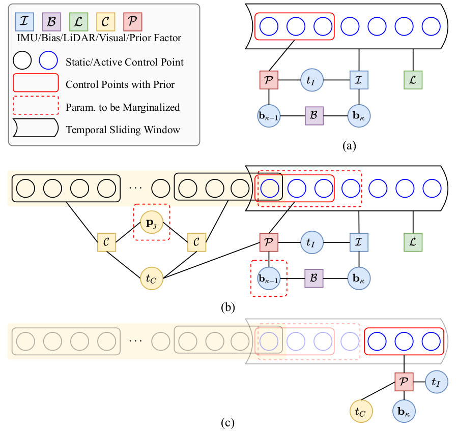

# CLIC

**Continuous-Time Fixed-Lag Smoothing for LiDAR-Inertial-Camera SLAM**

CLIC is a tightly-coupled multi-modal SLAM algorithms based on continuous-time fixed-lag smoothing, it supports a variety of sensor combinations, like the LiDAR-inertial and LiDAR-inertial-camera SLAM systems, and online timeoffset calibration is also naturally supported. More importantly, benefiting from the marginalization and the derived analytical Jacobians for optimization, the proposed continuous-time SLAM systems can achieve real-time performance regardless of the high complexity of continuous-time formulation. 



Factor graphs of multi-sensor fusion. For more details, please refer to the [paper](https://github.com/APRIL-ZJU/clic/doc). [[arxiv](https://arxiv.org/pdf/2302.07456)]

🎈 **[News]**  We release [Coco-LIC](https://github.com/APRIL-ZJU/Coco-LIC), which adopts non-uniform B-splines to tightly fuse LIC data.

### Prerequisites

- [ROS](http://wiki.ros.org/ROS/Installation) (tested with Melodic)

- Eigen3

- Ceres 1.14

- OpenCV 3.3

- yaml-cpp

  ```shell
  sudo apt-get install libyaml-cpp-dev
  ```

- [livox_ros_driver](https://github.com/Livox-SDK/livox_ros_driver.git)
- ~~Sophus~~ has been included in `src/sophus_lib`

### Install

```shell
mkdir -p ~/catkin_clic/src
cd ~/catkin_clic/src
git clone https://github.com/APRIL-ZJU/clic.git
git clone https://github.com/Livox-SDK/livox_ros_driver.git
cd ~/catkin_clic
catkin_make
source devel/setup.bash
```

### Example

- Download [ntu_viral_dataset](https://ntu-aris.github.io/ntu_viral_dataset/) or [newer_college_dataset](https://ori-drs.github.io/newer-college-dataset/stereo-cam/) or [LVI dataset](https://github.com/TixiaoShan/LVI-SAM#datasets) or [livox dataset](https://github.com/ziv-lin/r3live_dataset).

- Configure parameters in the `config/ct_odometry_***.yaml` file.

  - `config_path`: the path of `config` folder 
  - `bag_path`: the file path of rosbag  

- Run on ntu viral dataset for example.

  ```shell
  roslaunch clic odometry.launch config_path:=config/ct_odometry_ntu.yaml
  ```

  The estimated trajectory is saved in the folder`./src/clic/data`.

### Credits

This code was developed by Jiajun Lv and Xiaolei Lang from [APRIL Lab](https://april.zju.edu.cn/) in Zhejiang University.

For researchers that have leveraged or compared to this work, please cite the following:

```latex
@article{lv2023continuous,
  title={Continuous-Time Fixed-Lag Smoothing for LiDAR-Inertial-Camera SLAM},
  author={Lv, Jiajun and Lang, Xiaolei and Xu, Jinhong and Wang, Mengmeng and Liu, Yong and Zuo, Xingxing},
  journal={IEEE/ASME Transactions on Mechatronics},
  year={2023},
  publisher={IEEE}
}
```

### Acknowledgement

- The spline module is adapted from [basalt](https://gitlab.com/VladyslavUsenko/basalt-headers).
- The lidar fearure module is adapted from [LIO-SAM](https://github.com/TixiaoShan/LIO-SAM/tree/a246c960e3fca52b989abf888c8cf1fae25b7c25) and [loam_livox](https://github.com/hku-mars/loam_livox).
- The visual module is adapted from [VINS-Mono](https://github.com/HKUST-Aerial-Robotics/VINS-Mono).
- The IMU initializer module is adapted from [open_vins](https://github.com/rpng/open_vins).

Thanks for their excellent job!

### Licence

The code is released under the [GNU General Public License v3 (GPL-3)](https://www.gnu.org/licenses/gpl-3.0.txt).
