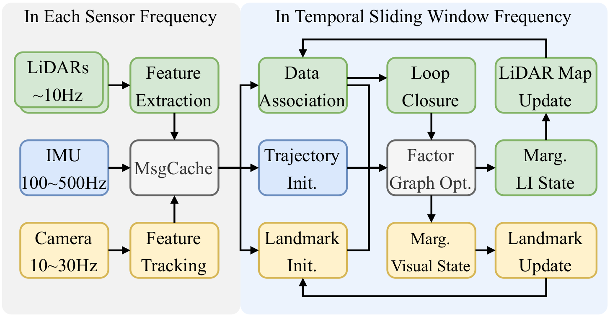
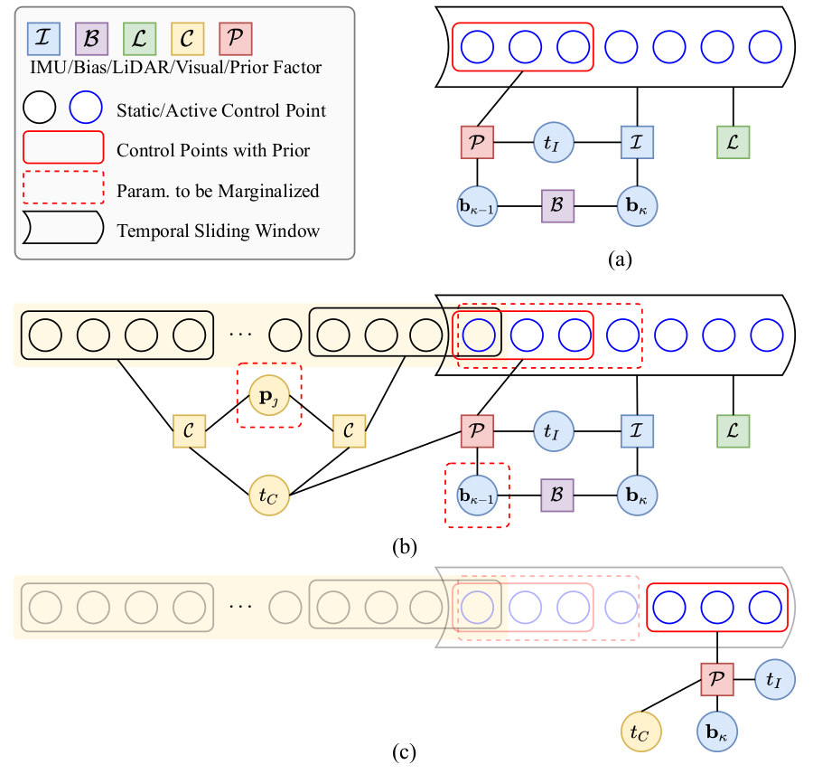
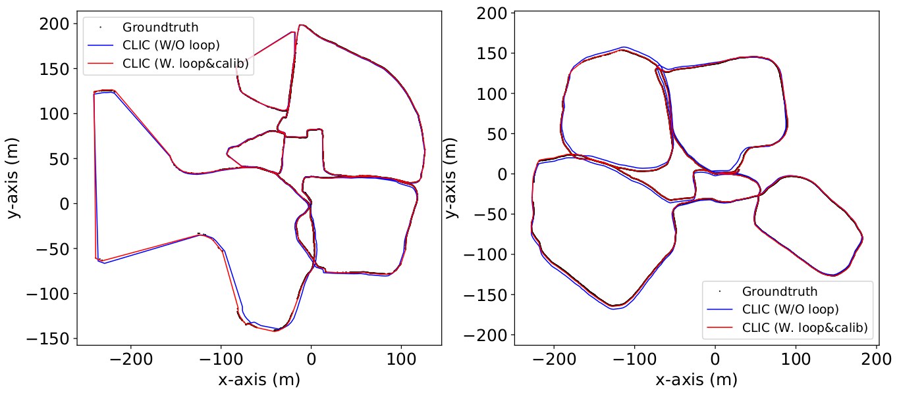
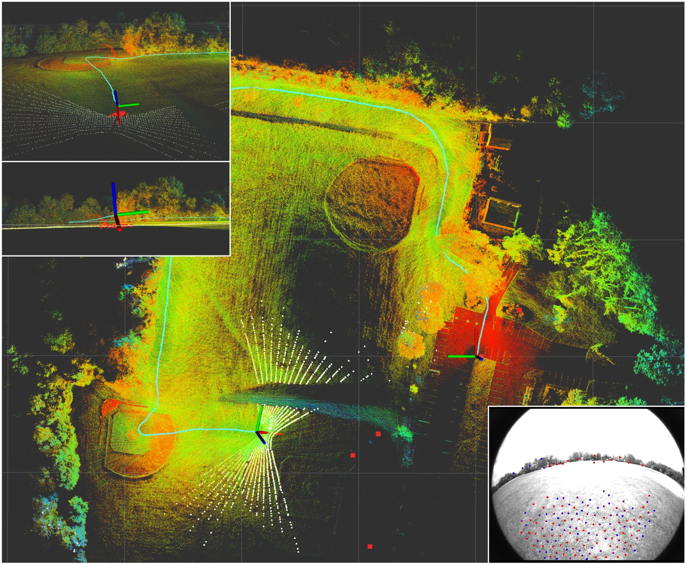

# clic

## Introduction

**Continuous-Time Fixed-Lag Smoothing for LiDAR-Inertial-Camera SLAM**

Localization and mapping with heterogeneous multi-sensor fusion have been prevalent in recent years. To adequately fuse multi-modal sensor measurements received at different time instants and different frequencies, we estimate the continuous-time trajectory by fixed-lag smoothing within a factor-graph optimization framework. With the continuous-time formulation, we can query poses at any time instants corresponding to the sensor measurements. To bound the computation complexity of the continuous-time fixed-lag smoother, we maintain temporal and keyframe sliding windows with constant size, and probabilistically marginalize out control points of the trajectory and other states, which allows preserving prior information for future sliding-window optimization. Based on continuous-time fixed-lag smoothing, we design tightly-coupled multi-modal SLAM algorithms with a variety of sensor combinations, like the LiDAR-inertial and LiDAR-inertial-camera SLAM  systems, in which online timeoffset calibration is also naturally supported. More importantly, benefiting from the marginalization and our derived analytical Jacobians for optimization, the proposed continuous-time SLAM systems can achieve real-time performance regardless of the high complexity of continuous-time formulation. The proposed multi-modal SLAM systems have been widely evaluated on three public datasets and a self-collect dataset. The results demonstrate that the proposed continuous-time SLAM systems can achieve high-accuracy pose estimations and outperform existing state-of-the-art methods.

The source code will be available after the publication of the related paper.

## Details

Fig1: The pipeline of the proposed LiDAR-Inertial-Camera fusion system. Raw IMU measurements, features of each LiDAR and tracked features of camera are cached in the MshCache module, and measurements are fed to the sliding window at  $\frac{1}{\eta \Delta t}$ Hz. After factor graph optimization, we separately marginalize LI state and visual state, and update local LiDAR map and visual landmarks.

Fig2: Factor graphs of multi-sensor fusion. (a) A typical factor graph of LI system fusion. (b) A typical factor graph of LIC system fusion. Active control points are to be optimized, while static control points remain constant. The control points with yellow background are involved in visual keyframe sliding window. (c) After marginalization of *(b)*, the induced prior factor is involved with the latest control points, latest bias and timeoffsets.

Tab1: The APE (RMSE, meter) results on VIRAL dataset. The best result is in bold, and the second best is underlined.

Fig3: The estimated trajectories compared to the groundtruth in LVI-SAM dataset.

Fig4: LiDAR map(color points) and visual landmarks (red squares) during the system passing open areas when running Handheld sequence. The current scan (white points) only observes the ground while camera can track stable visual features.

